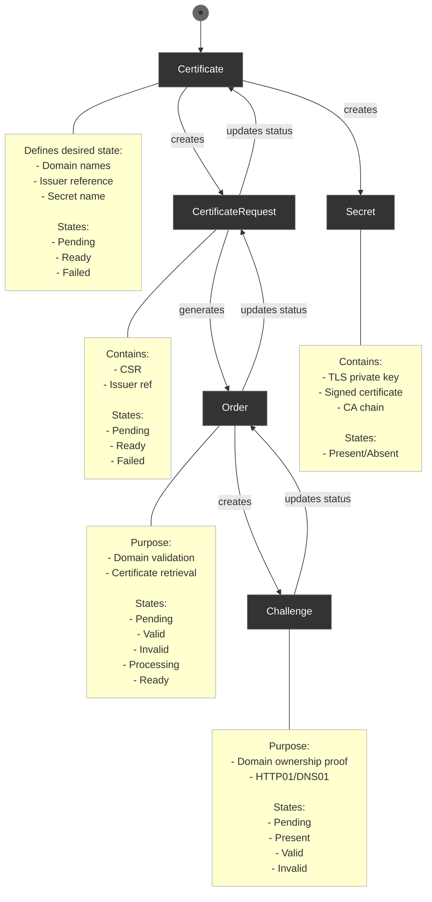

# cert-manager

cert-manager plugin for Headlamp adds a new item (cert-manager) to the sidebar to give users a way to view and manage cert-manager resources.

## Demo

<video src="https://github.com/user-attachments/assets/3bd40e22-94bc-4624-b7be-d303e3688dd9" width="300"></video>

## cert-manager CRDs:

- certificates.cert-manager.io
- certificaterequests.cert-manager.io
- orders.acme.cert-manager.io
- challenges.acme.cert-manager.io
- clusterissuers.cert-manager.io
- issuers.cert-manager.io
- clusterissuers.cert-manager.io

## Lifecycle:

Certificate -> CertificateRequest -> Order -> Challenge -> Secret

1. **Certificate** (Starting Point)

   - This is the main custom resource the user creates
   - It defines what the user wants: domain names, which issuer to use, and where to store the resulting certificate
   - States: Pending → Ready or Failed

2. **CertificateRequest**

   - Created automatically by the Certificate controller
   - Contains the Certificate Signing Request (CSR) and issuer reference
   - Acts as a one-time request for a certificate
   - States: Pending → Ready or Failed

3. **Order** (ACME specific)

   - Generated by the CertificateRequest when using ACME issuers (like Let's Encrypt)
   - Manages the domain validation process
   - States: Pending → Processing → Valid/Invalid → Ready

4. **Challenge** (ACME specific)

   - Created by the Order resource
   - Proves domain ownership to the ACME server
   - Two main types:
   - HTTP01: Places a file on the web server
   - DNS01: Creates a TXT record in the DNS
   - States: Pending → Present → Valid/Invalid

5. **Secret**
   - Final output containing:
   - The private key
   - The signed certificate
   - The CA certificate chain
   - Created/updated once the Challenge is successful

The flow works like this:

1. The user creates a Certificate resource
2. cert-manager creates a CertificateRequest
3. For ACME issuers, an Order is created
4. The Order creates one or more Challenges
5. Once Challenges are validated, the certificate is issued
6. The certificate is stored in a Kubernetes Secret

This process is automated and will repeat when the certificate needs renewal (typically around 30 days before expiration).

State diagram



# Testing the plugin

## Prerequisites

- A Kubernetes cluster with cert-manager installed
  - If you need to install cert-manager, follow the [official installation guide](https://cert-manager.io/docs/installation/)
- Node.js and npm installed on your system

## Steps to Test

1. Clone the plugins repository:

   ```bash
   git clone https://github.com/headlamp-k8s/plugins.git
   ```

2. Switch to the cert-manager branch:

   ```bash
   git checkout cert-manager
   ```

3. Navigate to the cert-manager plugin directory:

   ```bash
   cd cert-manager
   ```

4. Install the required dependencies:

   ```bash
   npm install
   ```

5. Start the plugin in development mode:

   ```bash
   npm run start
   ```

6. Launch Headlamp. You should now see "Cert Manager" in the sidebar.

## Optional: Generate Cert-Manager Resources

To test the plugin with sample cert-manager resources:

1. Navigate to the test-files directory:

   ```bash
   cd test-files
   ```

2. Apply the sample configurations to your cluster:
   ```bash
   kubectl apply -f clusterIssuer.yaml
   kubectl apply -f issuer.yaml
   kubectl apply -f certificate.yaml
   kubectl apply -f order.yaml
   kubectl apply -f app.yaml
   ```

This will create:

- A ClusterIssuer for Let's Encrypt staging
- An Issuer for Let's Encrypt staging
- Two Certificate resources (one using ClusterIssuer, one using Issuer)
- An Order resource
- Sample Nginx deployment with Ingress configurations
