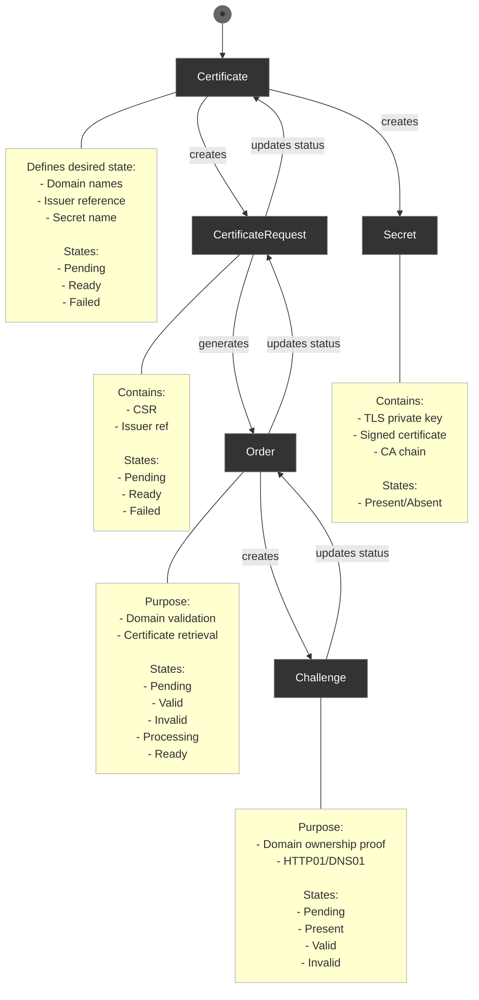

# cert-manager

Cert-manager plugin for Headlamp.

This is the default template README for [Headlamp Plugins](https://github.com/headlamp-k8s/headlamp).

- The description of your plugin should go here.
- You should also edit the package.json file meta data (like name and description).

## Developing Headlamp plugins

For more information on developing Headlamp plugins, please refer to:

- [Getting Started](https://headlamp.dev/docs/latest/development/plugins/), How to create a new Headlamp plugin.
- [API Reference](https://headlamp.dev/docs/latest/development/api/), API documentation for what you can do
- [UI Component Storybook](https://headlamp.dev/docs/latest/development/frontend/#storybook), pre-existing components you can use when creating your plugin.
- [Plugin Examples](https://github.com/headlamp-k8s/headlamp/tree/main/plugins/examples), Example plugins you can look at to see how it's done.

## Cert-manager CRDs:

- certificates.cert-manager.io
- certificaterequests.cert-manager.io
- orders.acme.cert-manager.io
- challenges.acme.cert-manager.io
- clusterissuers.cert-manager.io
- issuers.cert-manager.io
- clusterissuers.cert-manager.io

## Lifecycle:

Certificate -> CertificateRequest -> Order -> Challenge -> Secret

1. **Certificate** (Starting Point)

   - This is the main custom resource the user creates
   - It defines what the user wants: domain names, which issuer to use, and where to store the resulting certificate
   - States: Pending → Ready or Failed

2. **CertificateRequest**

   - Created automatically by the Certificate controller
   - Contains the Certificate Signing Request (CSR) and issuer reference
   - Acts as a one-time request for a certificate
   - States: Pending → Ready or Failed

3. **Order** (ACME specific)

   - Generated by the CertificateRequest when using ACME issuers (like Let's Encrypt)
   - Manages the domain validation process
   - States: Pending → Processing → Valid/Invalid → Ready

4. **Challenge** (ACME specific)

   - Created by the Order resource
   - Proves domain ownership to the ACME server
   - Two main types:
   - HTTP01: Places a file on the web server
   - DNS01: Creates a TXT record in the DNS
   - States: Pending → Present → Valid/Invalid

5. **Secret**
   - Final output containing:
   - The private key
   - The signed certificate
   - The CA certificate chain
   - Created/updated once the Challenge is successful

The flow works like this:

1. The user creates a Certificate resource
2. Cert-manager creates a CertificateRequest
3. For ACME issuers, an Order is created
4. The Order creates one or more Challenges
5. Once Challenges are validated, the certificate is issued
6. The certificate is stored in a Kubernetes Secret

This process is automated and will repeat when the certificate needs renewal (typically around 30 days before expiration).

State diagram

