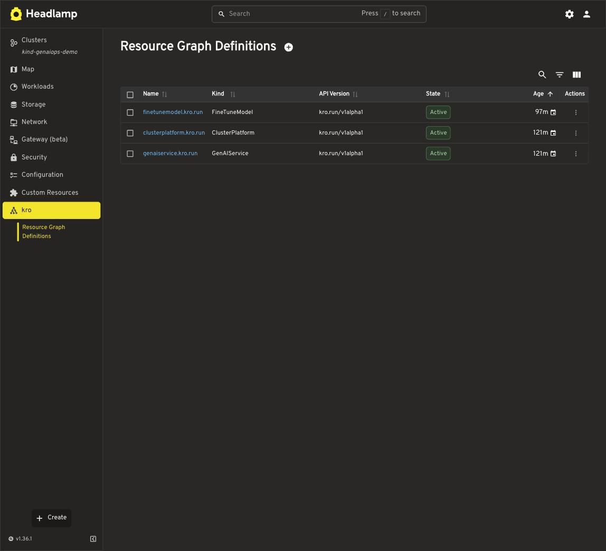
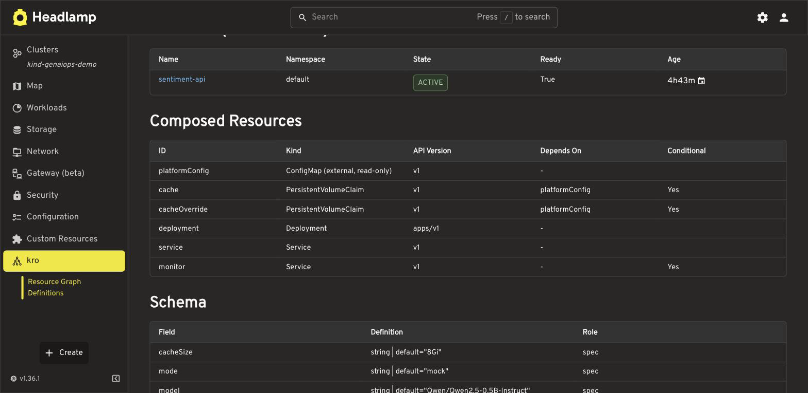
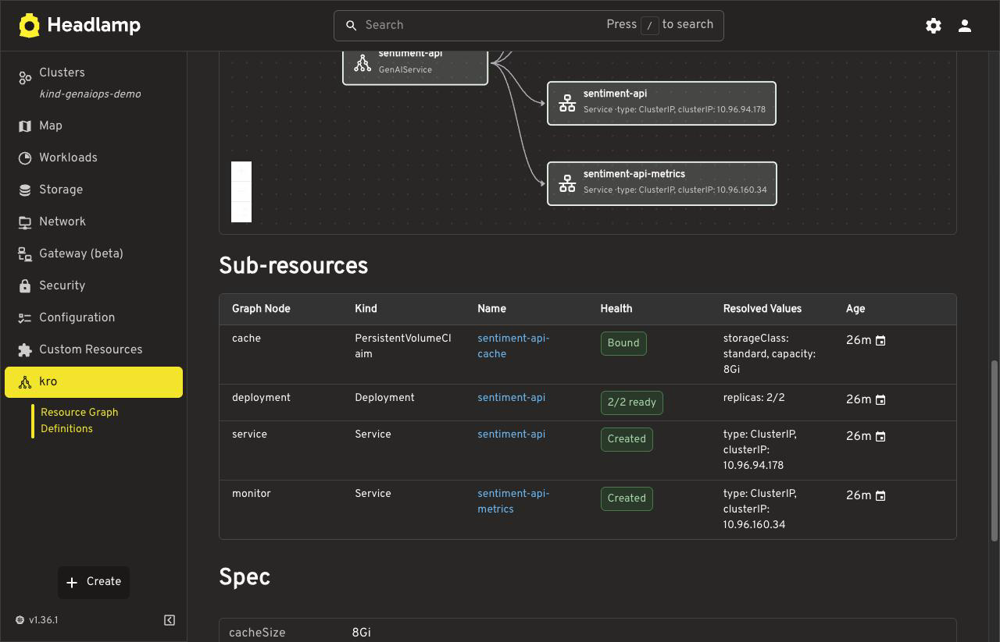
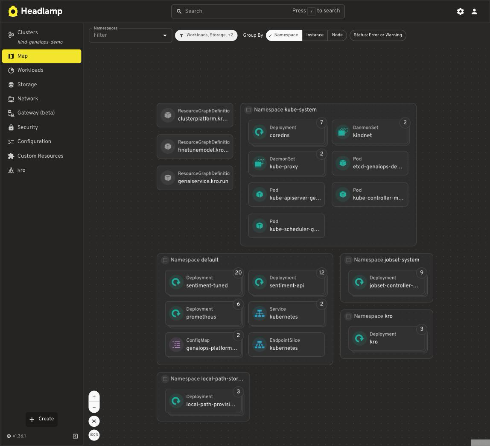

# Headlamp kro Plugin

> **Status: alpha.** This plugin is an early release and under active development.

A Headlamp plugin for [kro](https://kro.run) (Kube Resource Orchestrator). It adds
views for ResourceGraphDefinitions (RGDs), the resource APIs they generate, and
the resources kro creates on their behalf — all updating live via Kubernetes
watches.

## Features

- **ResourceGraphDefinition list and detail**: generated kind and API version,
  state, conditions, the composed resources ordered by kro's published
  topological order (with dependency and externalRef annotations), and a
  flattened SimpleSchema summary.
- **Instance views for generated APIs**: each Active RGD's generated CRD is
  discovered dynamically; instances get a list on the RGD detail page and a
  detail page with conditions, spec, and Headlamp's standard edit/delete
  actions.
- **Sub-resources with resolved values**: the resources kro created for an
  instance (found via kro's ownership labels), each with health, a link to its
  native Headlamp page, and the environment-resolved values that matter —
  PVC storageClassName, Deployment ready count, Service type.
- **Map integration**: a kro source for Headlamp's Map view showing RGDs,
  instances, and kro-managed resources; detail pages deep-link into the Map
  focused on the matching node.
- **New Instance**: opens Headlamp's YAML editor pre-filled with a minimal
  valid instance derived from the RGD's SimpleSchema.
- **Graceful degradation**: a friendly install pointer when kro is not on the
  cluster, and per-section RBAC degradation instead of broken pages.

## Screenshots

| ResourceGraphDefinitions | RGD detail |
| --- | --- |
|  |  |

| Instance sub-resources (resolved storageClass) | Map view |
| --- | --- |
|  |  |

## Installation

### Desktop app

Install from the Plugin Catalog once published to Artifact Hub, or install a
release tarball into your Headlamp plugins directory.

### Development

Clone this repository, then:

```bash
cd kro
npm install
npm run start
```

Open your local Headlamp (desktop app or dev instance) and the "kro" section
appears in the sidebar. To try the views against real data, install kro and
apply an RGD — see the [kro getting started guide](https://kro.run/docs/getting-started/Installation/).
