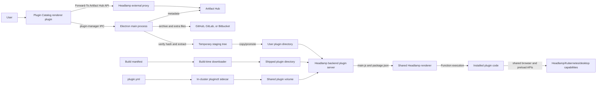

# STRIDE threat model: Headlamp Plugin Catalog

- Status: draft for initial stakeholder discussions
- Assessment date: 2026-08-18

## Executive summary

The Plugin Catalog is a software supply-chain and privileged code-loading
feature. It discovers packages through Artifact Hub, asks Headlamp Desktop to
download and install selected archives, and ultimately causes plugin JavaScript
to execute in Headlamp's shared renderer context. Some plugins may also install
platform binaries and receive native command permissions.

The recommended posture is to allow installation only from independently signed
metadata, execute plugins in isolated principals, reserve privileged package
identities, authorize plugin-management operations in the main process, and
make promotion atomic with rollback.

## Scope and evidence

This assessment covers:

- Plugin Catalog package `0.4.4` at repository commit
  `6b201b9db090afb2e9ecfb831eb70487e3ae200d`.
- Headlamp integration at commit
  `b4a77b4adad4219608f1bd527947aea35535505b`.
- Desktop catalog discovery, install, update, uninstall, activation, native
  command permission, and binary `PATH` behavior.
- Build-time bundled plugins and the optional in-cluster `pluginctl` sidecar,
  because they place code into the same plugin loading system.

The relevant tracked worktrees were clean when inspected. Generated bundles
were not primary evidence. This is a source and design review, not a penetration
test. Artifact Hub's server-side controls, release CI signing, source-host
account security, operating-system protections, deployment-specific CSP, and
third-party plugin code require separate assessment.

## Method and lifecycle

This document follows the [OWASP Threat Modeling Project](https://owasp.org/www-project-threat-modeling/)
four-question framework and uses STRIDE as the threat-identification technique:

1. **What are we working on?** Scope, assumptions, dependencies, entry and exit
   points, assets, data flows, and trust boundaries are documented below.
2. **What can go wrong?** Threats are enumerated systematically under Spoofing,
   Tampering, Repudiation, Information Disclosure, Denial of Service, and
   Elevation of Privilege.
3. **What are we going to do about it?** Each threat has a proposed response;
   the response register records whether to mitigate, eliminate, transfer, or
   explicitly accept the risk.
4. **Did we do a good enough job?** Acceptance criteria, adversarial tests, open
   questions, review responsibilities, and model update triggers are included.

This is consistent with the
[OWASP Threat Modeling Cheat Sheet](https://cheatsheetseries.owasp.org/cheatsheets/Threat_Modeling_Cheat_Sheet.html):
the system model is stored with the threat list, mitigations are actionable and
testable, assumptions are challengeable, and the model is intended to be
maintained with the system rather than treated as a one-time assessment.

### Evidence confidence

| Label     | Meaning                                                                                                       |
| --------- | ------------------------------------------------------------------------------------------------------------- |
| Verified  | Directly supported by inspected source, tests, dependency source, or a focused local check.                   |
| Plausible | The source exposes the necessary behavior, but a complete exploit or deployment condition was not tested.     |
| Open      | An external control or runtime condition was not available in the inspected source and requires confirmation. |

Threat descriptions use these labels to separate implementation facts from
assumptions. A threat is not a confirmed vulnerability merely because it is
listed; it becomes an actionable finding when its prerequisites and missing
controls are supported by evidence.

### Qualitative risk method

Risk is based on likelihood and impact, following OWASP's recommendation to
prioritize threats in the context of the system. Ratings are deliberately
qualitative because deployment policy, publisher controls, user privileges, and
operating-system protections vary.

| Rating | Likelihood criteria                                                                                               | Impact criteria                                                                                                    |
| ------ | ----------------------------------------------------------------------------------------------------------------- | ------------------------------------------------------------------------------------------------------------------ |
| High   | Reachable in expected operation with few preconditions, or readily automated after one trust boundary is crossed. | Broad compromise of Headlamp, user-accessible cluster authority, desktop files, or sustained service availability. |
| Medium | Requires control of a publisher/package, an installed plugin, user approval, or another material precondition.    | Material but bounded compromise, recoverable data loss, or loss of one security control.                           |
| Low    | Requires several uncommon conditions, local same-user access, or a narrow race.                                   | Limited disclosure/change or short-lived degradation with strong recovery controls.                                |

Overall ratings weigh impact, likelihood, existing controls, and confidence.
“Critical” is reserved for a credible path to broad compromise where the
necessary preconditions are part of the product's normal trust model. Final risk
acceptance belongs to the designated product and security owners.

### Maintenance triggers

Review this model when any of the following changes:

- Plugin runtime isolation, renderer origin, CSP, preload APIs, or Electron
  sandbox settings.
- Artifact Hub metadata, badge semantics, signing, repository ownership, or API
  behavior.
- Archive, extra-file, redirect, checksum, extraction, or promotion logic.
- Plugin permission manifests, reserved package identities, command consent, or
  binary execution and `PATH` behavior.
- Build manifest handling, release signing, `pluginctl`, chart defaults, or
  shared-volume ownership.
- A security incident, a new installation channel, or a new capability exposed
  to plugins.

At minimum, owners should review the model for each Plugin Catalog or Headlamp
release that changes these boundaries, and record accepted risks with an owner
and review date.

## Security objectives

1. Only code from the publisher and version the user or administrator approved
   can be installed and executed.
2. Package discovery labels, install policy, archive identity, package identity,
   and runtime permissions are cryptographically bound to one immutable record.
3. Untrusted archives and metadata cannot read, overwrite, delete, or execute
   files outside an isolated staging directory.
4. A plugin receives only explicit, least-privilege capabilities and cannot read
   another plugin's state or invoke privileged Electron operations by default.
5. Install, update, uninstall, rollback, and activation are atomic, recoverable,
   attributable, and resistant to replay or downgrade.
6. Downloads, metadata, extraction, rendering, status tracking, and sidecar
   reconciliation have bounded resource use.
7. “Official,” “Verified Publisher,” organization membership, checksums, and
   signatures are represented accurately and never imply stronger assurance
   than they provide.

## Architecture and data flows

### Textual data-flow walkthrough

The following flows describe the same model without relying on the diagram.
Each step identifies where data changes trust level or becomes executable.

#### DF-1: Discover and display catalog packages

1. The user opens the Plugin Catalog in Headlamp Desktop.
2. The catalog renderer reads its local display settings, including the
   official-only and verified-publisher filters.
3. The renderer constructs an Artifact Hub search URL and sends it to the local
   Headlamp backend in the `Forward-To` header of an `/externalproxy` request.
   This crosses **TB1**, because the response will influence the user's trust
   decision, and **TB3**, because Headlamp initiates an external network request.
4. The backend checks the initial destination against its configured proxy URL
   patterns, forwards the request, applies its timeout and response-size limit,
   and returns the Artifact Hub response to the renderer.
5. The catalog separately requests packages associated with the `headlamp`
   organization, merges them with the filtered search results, and removes
   duplicate package IDs.
6. Publisher-controlled names, descriptions, versions, logos, repository data,
   and Artifact Hub badge assertions are rendered as catalog cards. These values
   remain untrusted presentation data; the badges do not authorize installation.

#### DF-2: Display package details and historical versions

1. A catalog route supplies the repository and package names selected by the
   user.
2. The renderer requests current or historical package details from Artifact
   Hub through `/externalproxy`.
3. The response contains package metadata and a publisher-supplied README. The
   README crosses **TB1** when it is parsed by `markdown-to-jsx` and rendered in
   the shared Headlamp renderer.
4. The renderer asks Electron for the installed plugin list and compares the
   catalog version with locally recorded Artifact Hub metadata to decide whether
   to display Install, Update, or Uninstall actions.

#### DF-3: Request and approve a desktop installation

1. The user selects Install. The catalog sends an operation identifier, display
   name, and Artifact Hub package URL through the preload `plugin-manager`
   channel. This crosses **TB5** from renderer code into Electron main.
2. Electron validates the initial Artifact Hub URL prefix and fetches package
   metadata directly from Artifact Hub. This direct fetch does not use the
   catalog discovery proxy's response-size limit.
3. The metadata supplies the package name, version, compatibility range,
   archive URL, archive SHA-256, and optional platform extra-file annotations.
   These values cross **TB2** because Electron uses them to make filesystem and
   capability decisions.
4. Electron selects extra files matching the current operating system and
   architecture, then displays a native confirmation containing the
   renderer-supplied display name and the main and extra-file download URLs.
5. If the user declines, installation stops. If the user approves, Electron
   records operation state and may add saved native-command consent based on the
   metadata package name before the archive has been promoted.

#### DF-4: Download, verify, extract, and promote plugin files

1. Electron validates the initial archive URL against supported HTTPS source-host
   patterns and follows redirects to download the response. The source-host
   response crosses **TB3** into a temporary staging area.
2. Electron buffers the compressed response, computes SHA-256, and compares it
   with the expected value from Artifact Hub metadata. This detects a mismatch
   between those two values; it does not independently authenticate the
   publisher because both URL and digest share the metadata trust source.
3. Electron extracts archive entries into a newly created temporary directory.
   Archive paths and links cross **TB4**. The `tar` dependency applies default
   confinement controls, while Headlamp does not additionally reject every
   link entry or impose explicit expanded-size and file-count limits.
4. For matching platform extra files, Electron applies annotation-provided input
   and output mappings under the staged `bin` directory. These mappings also
   cross **TB4** because they are converted into local copy and delete paths.
5. Electron reads the extracted `package.json`, adds Artifact Hub provenance
   fields and the managed-plugin marker, and writes it back to staging.
6. The staged tree crosses **TB8** when it is recursively copied into the active
   user-plugin directory. This promotion is not an atomic generation switch.
7. For reserved Minikube folder names, Electron marks files in `bin` executable
   and prepends that directory to the desktop process `PATH`, crossing **TB7**
   from package identity into native execution authority.

#### DF-5: Update, uninstall, cancel, and query status

1. The catalog or any other code in the shared renderer can send Update,
   Uninstall, Cancel, List, or Get messages through `plugin-manager`, crossing
   **TB5**.
2. Electron stores operation state under the renderer-supplied identifier.
   Status and list responses return over the shared preload receive channel.
3. Update finds the active plugin by its internal package name, retrieves the
   latest metadata using the stored Artifact Hub URL, downloads and stages the
   candidate, removes the current directory, and then copies the candidate into
   place. Update has no install-style native confirmation or rollback.
4. Uninstall finds a managed plugin, removes saved command consent based on its
   internal package name, and recursively deletes the plugin directory. It also
   has no install-style native confirmation.
5. Cancel aborts the current controller when one is present. Temporary staging
   cleanup and operation-cache expiry are not consistently guaranteed by the
   inspected flow.

#### DF-6: Discover and execute installed plugin code

1. The Headlamp backend scans shipped, user, and development plugin directories
   and returns plugin paths and source types. These directories are data stores
   on opposite sides of **TB8** and **TB9**.
2. The renderer fetches each plugin's `package.json` and `main.js` from the
   backend, updates plugin settings, applies source precedence, checks Headlamp
   plugin API compatibility, and checks enabled state.
3. Selected `main.js` crosses **TB6** when Headlamp compiles it with `Function`
   and executes it in the shared renderer global context.
4. Headlamp grants selected native command wrappers only when both package name
   and recognized plugin path match. Other browser, Headlamp, and exposed preload
   capabilities remain shared according to the renderer's current architecture.
5. Plugin code can register UI and interact with data available to the user's
   Headlamp session. Any network or Kubernetes operation then crosses additional
   Headlamp trust boundaries outside the installation subsystem.

#### DF-7: Populate plugins outside the desktop catalog

1. During application or container builds, a build manifest supplies plugin
   archive URLs. Build scripts follow redirects, extract selected files, and
   place them in the shipped plugin directory. This crosses **TB9** without the
   desktop catalog's native consent path.
2. In an optional in-cluster deployment, `plugin.yml` supplies desired Artifact
   Hub package URLs and versions to the `pluginctl` sidecar.
3. The sidecar obtains its executable through the configured Node image and
   `npx` package version, downloads and verifies plugin archives using its own
   installer implementation, and writes plugins into a volume shared with
   Headlamp.
4. After reconciliation, the sidecar removes plugin directories that are not in
   the desired configuration. The resulting files cross **TB9** and later enter
   **DF-6** when Headlamp discovers and executes them.

### Principal flows

| Flow                      | Data and authority                                                                                | Current behavior                                                                                                                                                                                                               |
| ------------------------- | ------------------------------------------------------------------------------------------------- | ------------------------------------------------------------------------------------------------------------------------------------------------------------------------------------------------------------------------------ |
| Catalog discovery         | Search filters, package names, descriptions, logos, badges, versions, README                      | Catalog queries Artifact Hub through Headlamp's external proxy. Default discovery requests both `official=true` and `verified_publisher=true`; a separate `org=headlamp` query omits those filters and is merged into results. |
| Install request           | Artifact Hub package URL, display name, operation identifier                                      | Renderer sends `plugin-manager` IPC. Electron independently fetches package metadata and displays a native confirmation listing archive and matching extra-file URLs.                                                          |
| Download and extraction   | Metadata-provided URL, SHA-256, archive bytes, paths, package manifest, optional native binaries  | Electron restricts initial archive hosts, follows redirects, buffers the download, compares SHA-256, extracts with `tar`, rewrites package metadata, and copies into `user-plugins`.                                           |
| Update/uninstall          | Runtime package name and optional caller-provided destination                                     | Electron locates a managed plugin, destructively replaces or removes its directory. These operations do not show the install-style native confirmation.                                                                        |
| Activation                | `main.js`, `package.json`, plugin type and enabled state                                          | Backend lists shipped, user, and development directories. Frontend applies precedence and compatibility checks, then executes enabled code in the shared renderer.                                                             |
| Native capability         | Folder name, `package.json.name`, permission secret, saved consent, plugin `bin` directory        | Reserved Minikube and AI Assistant identities receive selected command APIs; Minikube plugin `bin` directories are prepended to the desktop process `PATH`.                                                                    |
| Build-time bundling       | Application build manifest archive URL                                                            | Build scripts download and extract shipped plugins without a manifest checksum in the inspected configuration.                                                                                                                 |
| In-cluster reconciliation | `plugin.yml`, mutable sidecar image/package defaults, Artifact Hub metadata, shared plugin volume | Optional sidecar runs `npx @headlamp-k8s/pluginctl ... --watch`, installs desired plugins, and removes directories absent from configuration.                                                                                  |

### External dependencies

| ID   | Dependency                                         | Security-relevant responsibility                                                                                                                         |
| ---- | -------------------------------------------------- | -------------------------------------------------------------------------------------------------------------------------------------------------------- |
| ED-1 | Artifact Hub API and account/organization controls | Package discovery, metadata availability, publisher and organization assertions, archive URL, checksum, versions, and README.                            |
| ED-2 | GitHub, GitLab, and Bitbucket release hosting      | Archive and selected platform-file availability, TLS, redirects, and account security.                                                                   |
| ED-3 | Operating system and filesystem                    | User identity, directory permissions, symlink behavior, executable permissions, temporary storage, atomic rename semantics, and local process isolation. |
| ED-4 | Electron and Chromium                              | Renderer isolation, preload boundary, navigation, storage, CSP, and IPC sender semantics.                                                                |
| ED-5 | Node `tar`, fetch, crypto, and filesystem APIs     | Download, hash, extraction, path, link, and file-operation behavior.                                                                                     |
| ED-6 | npm and container registry                         | `pluginctl`, sidecar base image, dependency integrity, and mutable tag behavior.                                                                         |
| ED-7 | Kubernetes and deployment policy                   | Sidecar identity, security context, shared volume, network egress, admission policy, and Headlamp's effective cluster authority.                         |

### Entry and exit points

| ID   | Direction | Interface                                      | Trust and data                                                                                                                                          |
| ---- | --------- | ---------------------------------------------- | ------------------------------------------------------------------------------------------------------------------------------------------------------- |
| EP-1 | Entry     | Artifact Hub search/detail responses           | Untrusted package metadata, badges, README, image IDs, versions, repository identity, archive URL, checksum, compatibility, and extra-file annotations. |
| EP-2 | Entry     | Catalog route parameters and version selection | Repository, package, historical version, display state, and operation identifier.                                                                       |
| EP-3 | Entry     | `plugin-manager` preload channel               | Renderer-supplied action, URL, display name, package name, identifier, and optional destination folder.                                                 |
| EP-4 | Entry     | Source-host response and redirect chain        | Archive bytes, response size, final location, content type, and timing.                                                                                 |
| EP-5 | Entry     | Archive and package contents                   | Paths, files, links, permissions, `main.js`, `package.json`, locales, and native binaries.                                                              |
| EP-6 | Entry     | Build manifest and `plugin.yml`                | Shipped or desired plugin sources, versions, dependencies, and reconciliation policy.                                                                   |
| XP-1 | Exit      | Catalog UI and native consent                  | Publisher-supplied text/images plus install name and download URLs presented to the user.                                                               |
| XP-2 | Exit      | Active plugin directories                      | Verified or unverified files become backend-served executable application content.                                                                      |
| XP-3 | Exit      | Shared renderer APIs and network               | Installed code can render UI and use capabilities available in its renderer context.                                                                    |
| XP-4 | Exit      | Desktop filesystem, settings, and `PATH`       | Installation writes files, persists command consent, and may add a plugin binary directory.                                                             |
| XP-5 | Exit      | Audit, console, progress, and status           | Operation identity, URLs, local paths, errors, consent, and result are disclosed or retained.                                                           |

## Assets

- Headlamp renderer integrity, DOM, routes, state, and user trust.
- Kubernetes credentials and cluster data reachable through Headlamp APIs.
- Backend token, desktop IPC operations, MCP operations, and native command
  permission secrets exposed to or mediated for renderer code.
- Shared `localStorage`, including all plugin configuration records and any
  secrets incorrectly persisted by plugins.
- User, shipped, and development plugin directories and precedence rules.
- Desktop filesystem, environment, executable search `PATH`, cloud CLI sessions,
  and platform binaries installed by selected plugins.
- Artifact Hub identities, labels, package metadata, versions, checksums, and
  historical records.
- Source-host release assets and publisher accounts.
- Build manifests, release artifacts, container images, npm package versions,
  in-cluster configuration, and shared plugin volumes.
- User approval decisions, enabled state, provenance records, audit events, and
  rollback data.

## Actors and assumptions

- A legitimate user may mistake “Official” or “Verified Publisher” for a code
  audit, overlook a changed URL, or approve a misleading package.
- A plugin publisher or maintainer account may be malicious or compromised.
- Artifact Hub, its API data, or organization membership may be compromised or
  incorrectly administered.
- A source host, release asset, redirect target, DNS/TLS trust point, custom CA,
  npm registry, or container registry may be compromised.
- An installed plugin may be malicious or compromised after an update.
- Another renderer plugin may call globally exposed preload operations.
- A local process under the desktop user may race or modify plugin directories.
  Such a process often already has broad authority, but plugin identity and
  activation should not make persistence or privilege use easier.
- Kubernetes and OS protections are correctly configured. They do not isolate
  JavaScript plugins from one another in the current shared renderer.

## Trust boundaries

| ID  | Boundary                                                             | Why it matters                                                                                                                         |
| --- | -------------------------------------------------------------------- | -------------------------------------------------------------------------------------------------------------------------------------- |
| TB1 | Artifact Hub catalog data to user                                    | Names, descriptions, logos, badges, README, versions, and repository identity influence trust decisions.                               |
| TB2 | Artifact Hub metadata to Electron main                               | Metadata controls archive location, expected checksum, package folder, compatibility, extra files, and native capability side effects. |
| TB3 | Source host and redirects to staging filesystem                      | Untrusted bytes become files and executable content.                                                                                   |
| TB4 | Archive entries and extra-file mappings to host paths                | Path handling determines whether installation remains confined.                                                                        |
| TB5 | Renderer to Electron plugin-management IPC                           | Crossing this boundary downloads code, writes/deletes directories, changes saved consent, and may alter `PATH`.                        |
| TB6 | Installed plugin to Headlamp renderer                                | Plugin code shares application origin and state rather than running as a separate principal.                                           |
| TB7 | Package/folder identity to special native permissions                | String identity determines command permission secrets, saved consent, and binary-path treatment.                                       |
| TB8 | Staging tree to active plugin directory                              | Promotion must preserve integrity, rollback, and availability.                                                                         |
| TB9 | Build manifest or `plugin.yml` to release/runtime plugin directories | Non-catalog channels can place equally trusted code into the loader.                                                                   |

## Existing security controls

The implementation already has controls worth preserving:

- The catalog is registered only in the desktop application.
- Discovery defaults to Artifact Hub packages marked both official and verified,
  and disabling the official-only view requires a warning confirmation.
- Documentation states that badges indicate provenance or affiliation and are
  not a substitute for reviewing code, permissions, and maintenance.
- The external proxy allowlists configured URL patterns, uses a 30-second
  context timeout, and limits responses to approximately 100 MiB.
- Desktop metadata URLs must start with the Artifact Hub Headlamp package path.
- Initial plugin archives are restricted to HTTPS release/archive patterns on
  GitHub, GitLab, and Bitbucket. Platform extra files currently use narrower
  Minikube and vfkit release prefixes.
- Main and extra-file archives require a checksum and are compared using
  SHA-256 before extraction.
- Headlamp version compatibility is checked when a Headlamp version is supplied.
- The `tar` dependency's default path handling rejects absolute and `..` archive
  paths and constrains link targets when `preservePaths` is not enabled.
- Install displays a native confirmation with archive and selected extra-file
  URLs before writing the plugin.
- Managed uninstall checks for `main.js`, `package.json`, and the
  `isManagedByHeadlampPlugin` marker.
- Electron uses context isolation and disables Node integration.
- Native command calls use command allowlists, random permission values, and
  saved consent. Permission secrets are passed only to recognized package/path
  combinations rather than every plugin.
- The in-cluster sidecar defaults to non-root, drops capabilities, disallows
  privilege escalation, and uses runtime-default seccomp when no broader pod
  security context overrides it.

These controls do not provide independent publisher authenticity, plugin
runtime isolation, IPC caller identity, canonical extra-file containment,
prototype-safe annotation conversion, atomic update, or signed freshness and
rollback.

## Focused abuse cases

These paths complement STRIDE by showing prerequisites and control transitions.
They are not claims that each path has been exercised end to end.

| ID   | Preconditions                                                                                                                                                                                                                                  | Path                                                                                                                                                                                                                                               | Potential outcome                                                                                                                                                                                                    | Confidence                                                                                                                                  |
| ---- | ---------------------------------------------------------------------------------------------------------------------------------------------------------------------------------------------------------------------------------------------- | -------------------------------------------------------------------------------------------------------------------------------------------------------------------------------------------------------------------------------------------------- | -------------------------------------------------------------------------------------------------------------------------------------------------------------------------------------------------------------------- | ------------------------------------------------------------------------------------------------------------------------------------------- |
| AC-1 | A package publisher or compromised metadata record can add arbitrary keys under the Artifact Hub package `data` object; a renderer initiates install for that package.                                                                         | Electron fetches metadata before displaying consent. `convertAnnotations` walks slash-delimited keys in plain objects. A key such as `__proto__/catalogProbe` traverses into `Object.prototype` and writes the value.                              | Main-process object behavior is modified before user approval. Consequences depend on reachable property lookups; denial of service or control-flow changes are plausible, while code execution was not established. | Verified primitive; downstream impact open. A focused local check reproduced pollution using the converter's exact algorithm.               |
| AC-2 | A publisher controls package extra-file annotations, references an allowed Minikube or vfkit release file with the correct checksum, and the user approves installation. The targeted local path exists and is accessible to the desktop user. | Nested `input` or `output`, such as `a/../../../../target`, passes prefix validation. `path.join` normalizes it outside `bin`; copy and removal operate on the resolved path.                                                                      | Read/copy, overwrite, or deletion of a known user-accessible path outside staging; copied data may be promoted into the plugin directory.                                                                            | Verified source path; not exercised against a real package. The source-host allowlist and install consent materially reduce likelihood.     |
| AC-3 | A publisher controls both Artifact Hub metadata and archive `package.json`; the user approves a package with a reserved folder name.                                                                                                           | Metadata name selects folder, early command consent, and Minikube `PATH` treatment. Archive package name participates in package/path recognition for command permission secrets. Repository and publisher are not bound to the reserved identity. | A third-party package may receive capabilities intended for Minikube or AI Assistant, including selected native commands; Minikube identity may also introduce a binary directory into `PATH`.                       | Plausible from verified identity checks; Artifact Hub duplicate-name/repository policy and an end-to-end permission invocation remain open. |
| AC-4 | An installed plugin is compromised or otherwise acts outside its intended behavior.                                                                                                                                                            | Shared-renderer code calls the globally exposed `plugin-manager` channel. Main does not identify the initiating plugin. Update and uninstall proceed without the install confirmation.                                                             | Silent update, removal, status interference, or attempted installation of another package. Install still presents native URL consent.                                                                                | Verified call path; impact depends on target plugin and filesystem state.                                                                   |
| AC-5 | A publisher controls the Artifact Hub README for a viewed package.                                                                                                                                                                             | The catalog passes README to `markdown-to-jsx` without overrides. The installed library supports raw HTML and does not block tags by default; local compilation produced `iframe`, `style`, and `script` React elements.                           | Embedded external content, tracking, UI alteration, or misleading presentation. Headlamp prevents external top-frame navigation. Script execution in the packaged renderer was not established.                      | Verified compilation and navigation control; runtime script effect open.                                                                    |
| AC-6 | A publisher account, Artifact Hub metadata, or a trusted interception point is compromised.                                                                                                                                                    | The same metadata response supplies archive URL and expected SHA-256. The replacement bytes match the replacement digest.                                                                                                                          | Unauthorized plugin code passes integrity comparison and executes after installation/activation.                                                                                                                     | Verified trust relationship; compromise likelihood is deployment-dependent.                                                                 |

### STRIDE coverage by modeled element

This matrix records that STRIDE was applied to the DFD elements rather than used
only as headings.

| Element                          | S   | T   | R   | I   | D   | E   | Primary threats                        |
| -------------------------------- | --- | --- | --- | --- | --- | --- | -------------------------------------- |
| User and catalog trust UI        | Yes | Yes | Yes | Yes | No  | Yes | S-3, S-4, T-9, R-1, I-4                |
| Artifact Hub metadata flow       | Yes | Yes | Yes | Yes | Yes | Yes | S-1, S-2, T-4, T-7, T-8, D-1           |
| External proxy and direct fetch  | Yes | Yes | Yes | Yes | Yes | No  | S-2, T-4, I-3, D-1                     |
| Renderer-to-main IPC             | Yes | Yes | Yes | Yes | Yes | Yes | T-3, R-3, D-4, E-3                     |
| Installer and extraction process | Yes | Yes | Yes | Yes | Yes | Yes | S-1, T-1, T-2, T-5, I-2, D-1, E-2, E-4 |
| Active plugin data store         | Yes | Yes | Yes | Yes | Yes | Yes | S-4, T-2, T-5, R-1, I-1, D-3, E-6      |
| Shared renderer process          | Yes | Yes | Yes | Yes | Yes | Yes | S-4, T-9, I-1, D-2, E-1, E-3           |
| Build and sidecar channels       | Yes | Yes | Yes | Yes | Yes | Yes | S-2, T-6, R-1, D-3, E-5                |

## STRIDE analysis

The ratings below apply the qualitative method above. Confidence and
prerequisites are described in the focused abuse cases and threat text. No risk
is accepted by this document; acceptance requires an owner and review date in
the response register.

### Spoofing

| ID  | Risk   | Threat and impact                                                                                                                                                                                                                                                                                                    | Existing controls and gaps                                                                                                                                                    | Recommended treatment                                                                                                                                                                                                                                    |
| --- | ------ | -------------------------------------------------------------------------------------------------------------------------------------------------------------------------------------------------------------------------------------------------------------------------------------------------------------------- | ----------------------------------------------------------------------------------------------------------------------------------------------------------------------------- | -------------------------------------------------------------------------------------------------------------------------------------------------------------------------------------------------------------------------------------------------------- |
| S-1 | High   | A package uses a reserved Artifact Hub name and a crafted `package.json.name` to impersonate Minikube or AI Assistant. Folder name controls install consent and `PATH`; folder plus internal package name controls special runtime permission secrets. This requires package control and user-approved installation. | Name validation rejects separators and `..`, but the metadata name is not bound to archive package identity, repository, signed publisher, or a reserved namespace.           | Reserve privileged IDs in main. Bind repository, Artifact Hub package ID, folder, `package.json.name`, version, publisher identity, digest, and capabilities in independently signed metadata. Reject any mismatch before extraction or consent changes. |
| S-2 | High   | A compromised publisher, Artifact Hub record, or trusted TLS interception point replaces both an archive and its expected checksum while impersonating a legitimate release.                                                                                                                                         | HTTPS and SHA-256 are used, but URL and checksum share one trust source.                                                                                                      | Verify signatures rooted independently of mutable package metadata, such as TUF/Sigstore-style identity and transparency. Pin publisher identity and repository, support revocation, and verify offline before activation.                               |
| S-3 | High   | “Official,” “Verified Publisher,” or `headlamp` organization membership is presented as stronger assurance than it provides. A direct IPC caller can also install a package that was never visible under the filters.                                                                                                | The UI reflects Artifact Hub booleans and documentation warns that verification is not an audit. Electron installer does not enforce those labels or an administrator policy. | Label exact assurance semantics and source. Enforce signed organization policy in main, independent of catalog display. Treat badges as advisory context, not authorization.                                                                             |
| S-4 | Medium | A plugin spoofs another plugin's display name, route, icon, or UI and solicits credentials or approvals.                                                                                                                                                                                                             | Plugin precedence is tracked by internal package name and source type, but arbitrary plugins share the UI and can register application surfaces.                              | Show immutable publisher/package identity in plugin-owned UI and settings; prevent protected route/brand registration; isolate plugin UI and visually identify its publisher.                                                                            |

### Tampering

| ID  | Risk   | Threat and impact                                                                                                                                                                                                                                                                                                                                  | Existing controls and gaps                                                                                                                                                                                                                                                                                  | Recommended treatment                                                                                                                                                                                                                                                                            |
| --- | ------ | -------------------------------------------------------------------------------------------------------------------------------------------------------------------------------------------------------------------------------------------------------------------------------------------------------------------------------------------------- | ----------------------------------------------------------------------------------------------------------------------------------------------------------------------------------------------------------------------------------------------------------------------------------------------------------- | ------------------------------------------------------------------------------------------------------------------------------------------------------------------------------------------------------------------------------------------------------------------------------------------------ |
| T-1 | High   | Nested extra-file `input` or `output` paths escape the plugin tree. Values such as `a/../../../../target` do not start with a forbidden prefix but resolve outside `bin`; copy and removal then operate on a known path accessible to the desktop user. Exploitation requires an approved package with a matching allowlisted platform extra file. | Initial prefix checks, source URL restrictions, SHA-256, and install consent reduce likelihood, but paths are not canonicalized and containment is not rechecked at use.                                                                                                                                    | Resolve every path against a canonical root and reject unless `path.relative(root, target)` is non-empty/non-escaping as intended. Use `lstat`/descriptor-relative operations to reject symlinks and races. Never copy, chmod, or delete outside staging. Add traversal tests on every platform. |
| T-2 | High   | Update removes the active plugin before promotion; install copies over an existing destination. A crash or copy failure leaves missing, partial, or stale code.                                                                                                                                                                                    | Errors are reported, but there is no transaction, fsync, backup, or rollback.                                                                                                                                                                                                                               | Stage and validate on the destination filesystem, fsync files and directory, atomically rename, retain the previous verified version, and restore automatically on startup or activation failure.                                                                                                |
| T-3 | High   | Renderer-controlled `destinationFolder`, identifiers, and package names redirect installation, update, or deletion to unintended locations or operations.                                                                                                                                                                                          | The standard frontend wrapper omits destination, but IPC accepts it and main forwards it. Folder checks focus on the eventual plugin marker rather than caller authority.                                                                                                                                   | Remove filesystem paths from renderer input. Derive fixed roots in main; use opaque install IDs; canonicalize and enforce containment at every operation; authorize the caller and action.                                                                                                       |
| T-4 | High   | Redirects leave the validated host/path and fetch attacker-controlled metadata or archives.                                                                                                                                                                                                                                                        | Initial Artifact Hub and source URLs are validated; fetch follows redirects without revalidating each hop.                                                                                                                                                                                                  | Disable automatic redirects or validate every hop's scheme, host, port, path, credentials, and DNS/IP class. Cap hops and bind final URL into signed metadata and consent.                                                                                                                       |
| T-5 | High   | An attacker tampers with plugin code after checksum verification but before or after activation, including local races, symlink replacement, backup restore, or shared-volume writes.                                                                                                                                                              | Hashing occurs before extraction; active files are not reverified against an immutable install record.                                                                                                                                                                                                      | Store a signed install manifest with per-file digests, use restrictive permissions, refuse symlinks, reverify at activation, monitor changes, and separate writable staging from read-only active content.                                                                                       |
| T-6 | High   | Build-time bundled plugins are replaced because application manifest entries contain URLs but no checksums, and download scripts follow redirects.                                                                                                                                                                                                 | TLS applies, but no inspected manifest digest or signature binds release content.                                                                                                                                                                                                                           | Require digest and signature in the build manifest; pin final URL; verify before extraction; make CI fail closed; include provenance/SBOM in the signed application release.                                                                                                                     |
| T-7 | Medium | A package sets an extremely high version to block ordinary updates, or historical/replayed metadata installs a vulnerable version.                                                                                                                                                                                                                 | Catalog intentionally permits historical versions; update only accepts a semver greater than the stored version. No signed freshness or revocation record is enforced.                                                                                                                                      | Store verified release sequence and timestamps; support policy-controlled rollback; enforce revoked/minimum versions; do not use version ordering alone as authenticity or recovery policy.                                                                                                      |
| T-8 | High   | Slash-delimited metadata annotations can pollute prototypes in Electron main before installation consent. `convertAnnotations` uses plain objects and follows inherited `__proto__`, `constructor`, and `prototype` properties.                                                                                                                    | Artifact Hub URL validation and TLS constrain the metadata source, but keys are not schema-allowlisted and dangerous property names are not rejected. A local check reproduced `Object.prototype` modification with the same algorithm. The downstream effect depends on available property-lookup gadgets. | Parse only a strict extra-file annotation schema into `Object.create(null)` or Maps; reject `__proto__`, `prototype`, and `constructor` at every level; avoid generic path-to-object conversion; add regression tests and restart the process after any detected pollution.                      |
| T-9 | Medium | Publisher README raw HTML can create active `iframe`, `style`, `object`, media, and link elements in the shared renderer, enabling UI alteration, embedded content, tracking, or misleading interaction.                                                                                                                                           | Headlamp redirects external top-frame navigation to the system browser. The Markdown library recommends explicitly voiding dangerous tags for untrusted input, but the catalog supplies no overrides. Script-element compilation was observed; script execution was not established.                        | Disable raw HTML or allowlist safe Markdown elements and attributes; override links/images; block `script`, `iframe`, `object`, `style`, forms, and active media; enforce CSP and add rendering tests with adversarial README content.                                                           |

### Repudiation

| ID  | Risk   | Threat and impact                                                                                                                                        | Existing controls and gaps                                                                                                                                                          | Recommended treatment                                                                                                                                                                                                                                     |
| --- | ------ | -------------------------------------------------------------------------------------------------------------------------------------------------------- | ----------------------------------------------------------------------------------------------------------------------------------------------------------------------------------- | --------------------------------------------------------------------------------------------------------------------------------------------------------------------------------------------------------------------------------------------------------- |
| R-1 | High   | A user, publisher, renderer plugin, or updater can dispute who initiated and approved an install/update/uninstall and which bytes ran.                   | Native install consent and console/progress messages exist, but there is no durable record binding actor, caller, publisher, metadata, final URL, digest, capabilities, and result. | Emit structured, append-only or externally shipped audit events with user/session, caller plugin, package ID, publisher identity, version, digest, URLs, consent, policy decision, file manifest, activation, rollback, and result. Redact local secrets. |
| R-2 | Medium | Special command consent is added by package metadata name and later removed by internal package name, making consent provenance and lifecycle ambiguous. | Consent is persisted, but its source artifact/digest is not recorded and install can grant multiple commands at once.                                                               | Store consent per immutable plugin identity and digest, list exact capabilities during install, expire/revoke on update or identity change, and record every use.                                                                                         |
| R-3 | Medium | In-memory operation status and caller-chosen identifiers can be overwritten, left stale, or confused across plugins.                                     | Responses use identifiers and status polling, but the cache is not durable or scoped to a caller.                                                                                   | Generate operation IDs in main; bind them to caller/session; enforce state transitions; persist terminal audit results; expire status safely.                                                                                                             |

### Information disclosure

| ID  | Risk   | Threat and impact                                                                                                                                                                                                                               | Existing controls and gaps                                                                                                                                                                                               | Recommended treatment                                                                                                                                                                                                                  |
| --- | ------ | ----------------------------------------------------------------------------------------------------------------------------------------------------------------------------------------------------------------------------------------------- | ------------------------------------------------------------------------------------------------------------------------------------------------------------------------------------------------------------------------ | -------------------------------------------------------------------------------------------------------------------------------------------------------------------------------------------------------------------------------------- |
| I-1 | High   | Installed plugin JavaScript can read shared `localStorage`, DOM/state, cluster data available through Headlamp, or globally exposed preload APIs and disclose them. This follows user-approved installation or another plugin-delivery channel. | Node integration is off and selected command secrets are scoped, but plugins execute in the same renderer global context and origin. Headlamp documentation explicitly identifies this shared-context trust requirement. | Run each plugin in a sandboxed renderer/iframe/worker with a unique origin and CSP. Expose narrow asynchronous capabilities through an identity-bound broker. Keep credentials and other plugins' state out of shared browser storage. |
| I-2 | High   | Extra-file traversal copies a local secret into the served plugin tree or another attacker-readable location before activation.                                                                                                                 | Source path prefix checks do not ensure canonical containment or reject symlink substitution.                                                                                                                            | Apply descriptor-relative containment and no-follow semantics; extract into a private mode-0700 root; never permit extra-file mappings outside declared archive entries and destinations.                                              |
| I-3 | Medium | The external proxy copies incoming headers to Artifact Hub and follows redirects, creating a potential disclosure path if future callers attach credentials, cookies, tracing data, or internal identity headers.                               | The current catalog request sets only content type and `Forward-To`; no sensitive automatic header was established. URL allowlisting and response limits exist, but comments acknowledge headers should be filtered.     | Construct an explicit outbound header allowlist, strip cookies, authorization, backend tokens, forwarding headers, and internal identity headers, and drop sensitive headers on every redirect.                                        |
| I-4 | Medium | Untrusted catalog README, descriptions, links, images, or embedded frames disclose user network metadata or support misleading interactions.                                                                                                    | Logo images use Artifact Hub image IDs and Headlamp prevents external top-frame navigation, but README HTML and embedded resource URLs remain publisher-controlled.                                                      | Apply a safe Markdown/HTML allowlist, proxy media through a bounded cache where appropriate, block active/content schemes and tracking URLs, mark external destinations, and enforce CSP.                                              |
| I-5 | Medium | Install and failure logs reveal local paths, archive URLs, repository details, or environment-specific proxy/CA information.                                                                                                                    | Logs assist diagnosis but are not systematically redacted.                                                                                                                                                               | Define log classification and redaction; avoid full local paths and query strings; keep secrets and headers out of progress, crash, and support data.                                                                                  |

### Denial of service

| ID  | Risk   | Threat and impact                                                                                                                                                  | Existing controls and gaps                                                                                                                                 | Recommended treatment                                                                                                                                                                             |
| --- | ------ | ------------------------------------------------------------------------------------------------------------------------------------------------------------------ | ---------------------------------------------------------------------------------------------------------------------------------------------------------- | ------------------------------------------------------------------------------------------------------------------------------------------------------------------------------------------------- |
| D-1 | High   | A very large archive, decompression bomb, huge file count, deep tree, or endless direct download exhausts desktop memory, disk, CPU, or file descriptors.          | Catalog discovery proxy is bounded, but Electron archive downloads are fully buffered and extraction has no explicit total expanded-byte/file-count quota. | Stream to bounded files; enforce compressed bytes, expanded bytes, file count, path depth, per-file size, time, and disk quotas; cancel and clean the full staging parent in `finally`.           |
| D-2 | High   | A plugin blocks the renderer, allocates unbounded memory, causes render loops, intercepts routes, or floods network/API calls, making all of Headlamp unavailable. | Plugin errors are caught only around initial synchronous execution; there is no runtime process isolation or resource budget.                              | Move plugins to isolated processes/frames/workers; rate-limit broker APIs; implement heartbeat/termination and automatic quarantine after crashes or hangs.                                       |
| D-3 | High   | Non-atomic update or sidecar cleanup removes working plugins during transient network, copy, configuration, or dependency failures.                                | Update deletes before promotion; `pluginctl` removes directories not present in desired config after reconciliation.                                       | Use transactional generations and atomic symlink/directory switching; validate all desired artifacts before cleanup; preserve last-known-good generation and require explicit destructive policy. |
| D-4 | Medium | Repeated install/status requests or arbitrary operation identifiers grow caches, listeners, temp trees, and concurrent work.                                       | Frontend listeners have timeout/message limits and downloads support abort signals, but main status entries and concurrency are not strongly bounded.      | Add caller quotas, global/per-package concurrency, operation expiry, idempotency keys, temp cleanup, bounded retries, and backpressure.                                                           |
| D-5 | Medium | Catalog discovery enumerates all matching pages and can consume excessive network/time if metadata totals are malicious or very large.                             | Page size is capped at 60 and the proxy has timeout/response limits per request. Total pages and aggregate work are not independently capped.              | Cap total packages/pages/bytes/time, paginate on demand, cache verified responses, and stop on inconsistent metadata.                                                                             |

### Elevation of privilege

| ID  | Risk   | Threat and impact                                                                                                                                                                                                                                                                                         | Existing controls and gaps                                                                                                                                                                              | Recommended treatment                                                                                                                                                                                                                                       |
| --- | ------ | --------------------------------------------------------------------------------------------------------------------------------------------------------------------------------------------------------------------------------------------------------------------------------------------------------- | ------------------------------------------------------------------------------------------------------------------------------------------------------------------------------------------------------- | ----------------------------------------------------------------------------------------------------------------------------------------------------------------------------------------------------------------------------------------------------------- |
| E-1 | High   | A catalog-installed plugin gains the Headlamp renderer's effective authority, including access to Kubernetes operations and preload channels available to that frame. Installation is an explicit trust decision, but the UI does not enumerate these effective capabilities.                             | Compatibility/enabled checks decide whether code loads; they are not a security sandbox. New plugins default enabled.                                                                                   | Make plugin isolation the primary boundary. Define a declarative permission manifest, obtain informed consent, enforce permissions outside the plugin process, and default to no cluster/native access.                                                     |
| E-2 | High   | Reserved-name impersonation can grant Minikube `PATH` treatment, saved native command consent, and package-scoped command permission secrets to third-party code.                                                                                                                                         | Folder and package name are both checked at runtime, but each is supplied by package metadata/archive and is not bound to an approved publisher. User install consent remains a prerequisite.           | Hard-code reserved identities to shipped/signed publisher keys and repositories. Never grant capability from a display/package string. Bind consent and permission secret to verified digest and install source.                                            |
| E-3 | High   | Any renderer plugin invokes `plugin-manager` directly to install another payload, update itself, uninstall a security plugin, enumerate plugins, or target a caller-selected directory.                                                                                                                   | Preload allowlists the channel, and install asks the desktop user to confirm URLs. The channel is global and main does not authenticate plugin caller; update/uninstall are not equivalently confirmed. | Replace the shared channel with per-plugin capabilities. Restrict management to trusted Headlamp UI, verify sender frame and app state as defense in depth, and require native confirmation/policy for every privilege-increasing or destructive operation. |
| E-4 | High   | Platform binaries are marked executable and a reserved plugin's `bin` directory is prepended to the desktop process `PATH`, allowing command substitution.                                                                                                                                                | Only Minikube folder names qualify, but package provenance is not independently verified.                                                                                                               | Avoid mutating global `PATH`; execute an absolute digest-verified binary through a capability broker; sandbox it; bind binary identity/version to signed metadata and consent.                                                                              |
| E-5 | High   | Mutable in-cluster defaults execute a compromised `node:lts-alpine` image or `@headlamp-k8s/pluginctl@latest`, then write attacker code to the shared plugin volume.                                                                                                                                      | Sidecar security context limits kernel capabilities, but image/package provenance and content are mutable by default.                                                                                   | Pin image by digest and `pluginctl` by exact version/integrity; verify signatures and lockfile; use read-only roots and a transactional output volume; apply admission policy.                                                                              |
| E-6 | Medium | User/development plugin precedence overrides a shipped plugin with the same internal package name, replacing trusted behavior.                                                                                                                                                                            | Precedence is intentional and exposed in settings, but collision can become an impersonation and persistence mechanism.                                                                                 | Key plugins by signed publisher plus package ID, protect shipped identities, require explicit collision approval, and visually distinguish overrides on every affected UI surface.                                                                          |
| E-7 | Medium | Reserved-package command consent is persisted after the user accepts the install dialog but before download, extraction, or promotion completes. A failed or cancelled installation can leave consent that is not tied to installed bytes, and the dialog does not enumerate the commands being approved. | Command execution still requires the matching package/path permission secret and command allowlist, so stale consent alone is insufficient to execute a command.                                        | Grant consent only after verified atomic promotion; bind it to publisher, package, digest, and capability manifest; list each command class in consent; revoke on failure, cancellation, removal, identity change, or update.                               |

## Priority remediation plan

### P0: required before treating catalog installs as authenticated code

1. **Fix extra-file containment.** Canonicalize every path, reject escapes and
   symlinks, and use descriptor-relative no-follow file operations. Add tests for
   nested traversal, Unicode/separator variants, symlink races, Windows drive and
   UNC paths, and malicious cleanup targets.
2. **Introduce independent signed provenance.** Bind publisher identity,
   repository, immutable package ID, version, compatibility, archive/extra-file
   final URLs, digests, package name, and requested capabilities. Verify in main
   before consent, extraction, and activation.
3. **Reserve privileged identities.** Minikube, AI Assistant, Plugin Catalog,
   and future privileged packages must resolve only to approved signing keys and
   repositories. Remove name-based command consent and `PATH` grants.
4. **Isolate plugin runtime.** Execute plugins as separate principals with unique
   origins and narrow brokered capabilities. Remove global access to plugin
   management, backend tokens, MCP, and other privileged preload APIs.
5. **Authorize management in main.** Derive fixed filesystem destinations,
   generate operation IDs, authenticate the trusted management UI, enforce
   administrator install policy, and bind native consent to exact signed bytes
   and capabilities.
6. **Make lifecycle operations transactional.** Fully validate a staged
   generation, atomically promote it, keep a last-known-good generation, and
   rollback on copy, activation, health, or startup failure.

### P1: high-value defense in depth

1. Revalidate every redirect hop and send only an explicit safe header set.
2. Add compressed/expanded size, file count, depth, time, disk, concurrency, and
   temp-lifetime limits to every desktop, build, and sidecar download path.
3. Reverify an immutable per-file install manifest before every activation and
   after filesystem changes.
4. Add durable audit and revocation records for discovery policy, consent,
   installation, update, rollback, enable/disable, capability use, and removal.
5. Require confirmation for update, uninstall, downgrade, collision, capability
   change, publisher change, and final URL/digest change.
6. Pin build manifest artifacts, container images, npm versions, and lockfile
   integrity; publish signed SBOM and provenance for Headlamp releases.
7. Sanitize catalog Markdown and external resources, and show the exact source
   and semantics of trust badges.

### P2: resilience and governance

1. Add organization-level allow/deny policy by publisher key, repository,
   package, version, capability, cluster environment, and revocation state.
2. Add staged rollout, health checking, automatic quarantine, and safe mode that
   starts Headlamp without third-party plugins.
3. Provide provenance and permission diffs between installed and candidate
   versions, not only version numbers.
4. Add retention controls for audit, caches, old generations, and failed staging
   trees.

## Proposed response register

OWASP distinguishes mitigation from elimination, transfer, and explicit risk
acceptance. This draft proposes responses for discussion; it does not record any
risk as accepted. A final decision should include a tracking issue, accountable
team, target release or review date, and residual-risk statement.

| Threats                 | Proposed response                                                                                                                              | Priority | Completion evidence                                                                                            |
| ----------------------- | ---------------------------------------------------------------------------------------------------------------------------------------------- | -------- | -------------------------------------------------------------------------------------------------------------- |
| T-1, I-2                | Mitigate: enforce canonical containment and no-follow file operations for every extra-file path.                                               | P0       | Cross-platform traversal, link, and race tests pass; no file operation can escape staging.                     |
| T-8                     | Eliminate the generic annotation-to-object conversion; parse a strict schema into prototype-free structures.                                   | P0       | Prototype-pollution regression tests cover all dangerous property names and nesting levels.                    |
| S-1, E-2, E-4, E-7      | Mitigate: reserve privileged identities and bind native capabilities and consent to verified publisher, package, version, and digest.          | P0       | Identity-confusion tests fail closed; no global `PATH` mutation is based only on a folder name.                |
| S-2, T-4, T-5, T-6, T-7 | Mitigate: independently signed metadata, redirect validation, activation verification, revocation, and rollback policy.                        | P0/P1    | Altered metadata, replayed versions, changed redirects, and modified active files are rejected.                |
| I-1, D-2, E-1, E-3, E-6 | Mitigate through plugin isolation and identity-bound capability brokering; eliminate globally shared privileged renderer APIs where practical. | P0       | An unprivileged test plugin cannot access another plugin's state or undeclared Headlamp/Electron capabilities. |
| T-2, D-3                | Mitigate with validated generations, atomic promotion, last-known-good recovery, and non-destructive reconciliation.                           | P0       | Fault-injection tests at each lifecycle step preserve one complete verified generation.                        |
| T-3, R-3, D-4           | Mitigate in Electron main with fixed roots, generated operation IDs, caller policy, state validation, quotas, and expiry.                      | P0/P1    | Crafted renderer messages cannot choose paths, collide with operations, or create unbounded work.              |
| S-3, S-4, T-9, I-4      | Mitigate with precise trust-label language, protected UI identities, safe Markdown rendering, external-content policy, and CSP.                | P1       | Adversarial metadata/README tests cannot create active content or visually impersonate protected UI.           |
| R-1, R-2, I-5           | Mitigate with structured, redacted audit records that bind consent and capability use to immutable package identity.                           | P1       | Audit tests reconstruct lifecycle and consent decisions without exposing secrets.                              |
| I-3                     | Mitigate with an explicit outbound proxy header allowlist and redirect-time header stripping.                                                  | P1       | Proxy tests prove authentication, cookie, forwarding, and internal headers never leave Headlamp.               |
| D-1, D-5                | Mitigate with aggregate request, archive, extraction, pagination, time, concurrency, and disk budgets.                                         | P1       | Boundary and exhaustion tests terminate predictably and clean all temporary state.                             |
| E-5                     | Mitigate by pinning sidecar image and package identities and applying the same artifact verification policy as desktop.                        | P1       | Deployment policy rejects mutable production references and unverified plugin generations.                     |

## Review and validation

This section addresses OWASP's “Did we do a good enough job?” question. Before
changing the status from draft, stakeholders should confirm:

- The diagram and DF-1 through DF-7 accurately describe supported desktop,
  build-time, and in-cluster installation paths.
- Every external entity, process, data store, entry/exit point, and trust
  boundary relevant to plugin installation and execution is represented.
- Each STRIDE category was considered for every modeled element, and each
  retained threat has evidence, prerequisites, an impact, and an actionable
  proposed response.
- Security, desktop, frontend, release engineering, plugin maintainers, and the
  Artifact Hub integration maintainers have reviewed assumptions in their area.
- Open questions that materially change likelihood or impact are resolved or
  tracked with an explicit owner and review date.
- Proposed mitigations have measurable acceptance criteria and automated tests
  where practical.
- Any accepted, transferred, or deferred risk is recorded outside this document
  with rationale, accountable authority, expiry/review date, and residual risk.
- The source revisions and evidence links are refreshed whenever the model is
  updated.

## Security acceptance criteria

- `a/../../target`, encoded or mixed-separator variants, symlink/hardlink races,
  Windows drive/UNC paths, and malicious cleanup paths cannot access anything
  outside the private staging root.
- Replacing both Artifact Hub's URL and SHA-256 does not permit installation
  without a valid signature from the policy-approved publisher identity.
- A package named `headlamp_minikube`, `headlamp_ai-assistant`, or another
  reserved identity is rejected unless repository, package ID, internal package
  name, signing key, version, and digest all match policy.
- An ordinary renderer plugin cannot send plugin-management operations, request
  backend tokens, invoke MCP, or receive another plugin's state without an
  explicit capability.
- An installed plugin cannot read another plugin's storage, Headlamp credentials,
  or DOM/state merely because it renders UI.
- Installation and update either activate the complete verified generation or
  leave the prior version intact; process termination at every filesystem step
  passes recovery tests.
- Activation rechecks a signed per-file manifest and rejects local tampering.
- Redirects to an unapproved scheme, host, port, path, credential-bearing URL,
  loopback/link-local/private address, or excess hop count are rejected.
- Direct downloads and extraction stop at configured compressed, expanded,
  file-count, depth, disk, time, and concurrency limits and remove all staging
  data on failure/cancel.
- Audit records identify the initiator, caller principal, policy, publisher,
  package, version, final URL, digest, signature, requested capabilities,
  consent, activation, rollback, and result without storing secrets.
- Build-time and in-cluster installation verify the same provenance policy as
  desktop installation; images and package managers use immutable pins.

## Suggested adversarial tests

| Test                                                                                                                        | Expected result                                                                                                                                  |
| --------------------------------------------------------------------------------------------------------------------------- | ------------------------------------------------------------------------------------------------------------------------------------------------ |
| Publish an extra-file mapping with `a/../../../../outside` as input or output.                                              | Metadata is rejected before download and no outside path is read, copied, chmodded, or deleted.                                                  |
| Use a symlink inside staging that is swapped between validation and copy.                                                   | Descriptor-relative no-follow operation rejects it; no race escapes staging.                                                                     |
| Publish metadata name `headlamp_minikube` with archive package name `@headlamp-k8s/minikube` from an unapproved repository. | Reserved identity policy rejects it; no consent, `PATH`, or permission secret changes occur.                                                     |
| Change archive bytes and the SHA-256 in Artifact Hub metadata together.                                                     | Independent signature/transparency verification fails.                                                                                           |
| Redirect an approved GitHub URL to another host, loopback, link-local, private IP, or credential-bearing URL.               | Redirect validation rejects the hop and strips sensitive headers.                                                                                |
| From a harmless test plugin, send `INSTALL`, `UPDATE`, `UNINSTALL`, and custom `destinationFolder` messages.                | Main rejects every request because the plugin lacks management capability.                                                                       |
| Terminate Headlamp before/during copy, rename, fsync, activation, and cleanup.                                              | On restart, the previous verified plugin remains active or the complete candidate is activated; no partial state loads.                          |
| Supply a compressed bomb, millions of tiny files, deep paths, or an endless body.                                           | Quotas terminate the operation, clean staging, and keep Headlamp responsive.                                                                     |
| Modify active `main.js` after installation.                                                                                 | Activation integrity check quarantines the plugin and records an audit event.                                                                    |
| Install a plugin that reads `localStorage`, accesses another plugin's DOM, requests the backend token, or invokes MCP.      | Isolation and broker policy deny access unless each capability was explicitly granted.                                                           |
| Reconcile an empty or temporarily invalid `plugin.yml` in the sidecar.                                                      | Last-known-good plugins remain active; no destructive cleanup happens until a complete verified generation is ready and policy approves removal. |
| Use mutable image/npm tags in a production chart.                                                                           | Admission or chart validation rejects the deployment unless immutable digests/versions and integrity are supplied.                               |

## Open questions

1. What exact Artifact Hub controls produce `official`,
   `verified_publisher`, organization membership, and `signed`, and can package
   or historical-version metadata be modified after publication?
2. Is the `headlamp` Artifact Hub organization intended as a formal allowlist?
   If so, who governs membership and how is that policy independently verified?
3. Are GitHub release assets, plugin packages, application manifests, final
   desktop packages, container images, or npm packages signed and verified in
   release CI outside the inspected runtime/build paths?
4. Should privileged package identities be installable from any Artifact Hub
   repository, or only from Headlamp-controlled publisher keys?
5. What effective CSP and Electron renderer sandbox settings apply in every
   packaged mode, beyond context isolation and disabled Node integration?
6. Does the `tar` dependency configuration permit symlink or hardlink entries
   that create useful attacks inside otherwise confined extraction, and are
   platform-specific filesystem semantics covered by tests?
7. What local permissions, ownership, quarantine, code-signing, malware scanning,
   and backup/restore controls protect active plugin directories on macOS,
   Windows, and Linux?
8. Should updates automatically inherit previously granted capabilities, or
   require renewed consent when code digest, publisher, URLs, permissions, or
   native binaries change?
9. How should emergency revocation work when Headlamp is offline or Artifact Hub
   is unavailable?
10. Is the optional `pluginctl` sidecar expected to own the entire shared plugin
    directory? If not, its cleanup semantics need a stronger ownership model.

## Source evidence

### Plugin Catalog

- Package identity and version:
  [package.json](../package.json#L1).
- Desktop-only registration:
  [index.tsx](../src/index.tsx#L12).
- Discovery filters, `headlamp` organization merge, install-state matching, and
  non-official warning:
  [List.tsx](../src/components/plugins/List.tsx#L15),
  [List.tsx](../src/components/plugins/List.tsx#L57),
  [List.tsx](../src/components/plugins/List.tsx#L105),
  [List.tsx](../src/components/plugins/List.tsx#L188).
- Headlamp backend endpoint selection for catalog API requests:
  [externalProxy.ts](../src/components/plugins/externalProxy.ts#L1).
- Artifact Hub badges are rendered from response booleans:
  [PluginCard.tsx](../src/components/plugins/PluginCard.tsx#L59).
- Package details, historical version metadata, install/update/uninstall calls,
  and status polling:
  [Detail.tsx](../src/components/plugins/Detail.tsx#L333),
  [Detail.tsx](../src/components/plugins/Detail.tsx#L381),
  [Detail.tsx](../src/components/plugins/Detail.tsx#L469).

### Headlamp Desktop and runtime

- Renderer plugin-management API:
  [pluginManager.ts](https://github.com/kubernetes-sigs/headlamp/blob/b4a77b4adad4219608f1bd527947aea35535505b/frontend/src/components/App/pluginManager.ts#L30).
- Preload exposes the `plugin-manager` channel to renderer code:
  [preload.ts](https://github.com/kubernetes-sigs/headlamp/blob/b4a77b4adad4219608f1bd527947aea35535505b/app/electron/preload.ts#L34).
- Main-process install consent and install/update/uninstall IPC behavior:
  [main.ts](https://github.com/kubernetes-sigs/headlamp/blob/b4a77b4adad4219608f1bd527947aea35535505b/app/electron/main.ts#L289),
  [main.ts](https://github.com/kubernetes-sigs/headlamp/blob/b4a77b4adad4219608f1bd527947aea35535505b/app/electron/main.ts#L342),
  [main.ts](https://github.com/kubernetes-sigs/headlamp/blob/b4a77b4adad4219608f1bd527947aea35535505b/app/electron/main.ts#L438).
- Installer lifecycle and destructive update:
  [plugin-management.ts](https://github.com/kubernetes-sigs/headlamp/blob/b4a77b4adad4219608f1bd527947aea35535505b/app/electron/plugin-management.ts#L198),
  [plugin-management.ts](https://github.com/kubernetes-sigs/headlamp/blob/b4a77b4adad4219608f1bd527947aea35535505b/app/electron/plugin-management.ts#L278).
- URL checks, checksum verification, extraction, package metadata rewrite, and
  extra-file remapping:
  [plugin-management.ts](https://github.com/kubernetes-sigs/headlamp/blob/b4a77b4adad4219608f1bd527947aea35535505b/app/electron/plugin-management.ts#L470),
  [plugin-management.ts](https://github.com/kubernetes-sigs/headlamp/blob/b4a77b4adad4219608f1bd527947aea35535505b/app/electron/plugin-management.ts#L519),
  [plugin-management.ts](https://github.com/kubernetes-sigs/headlamp/blob/b4a77b4adad4219608f1bd527947aea35535505b/app/electron/plugin-management.ts#L621),
  [plugin-management.ts](https://github.com/kubernetes-sigs/headlamp/blob/b4a77b4adad4219608f1bd527947aea35535505b/app/electron/plugin-management.ts#L739),
  [plugin-management.ts](https://github.com/kubernetes-sigs/headlamp/blob/b4a77b4adad4219608f1bd527947aea35535505b/app/electron/plugin-management.ts#L932),
  [plugin-management.ts](https://github.com/kubernetes-sigs/headlamp/blob/b4a77b4adad4219608f1bd527947aea35535505b/app/electron/plugin-management.ts#L985).
- Managed folder checks and reserved Minikube binary `PATH` behavior:
  [plugin-management.ts](https://github.com/kubernetes-sigs/headlamp/blob/b4a77b4adad4219608f1bd527947aea35535505b/app/electron/plugin-management.ts#L1065),
  [plugin-management.ts](https://github.com/kubernetes-sigs/headlamp/blob/b4a77b4adad4219608f1bd527947aea35535505b/app/electron/plugin-management.ts#L1124),
  [plugin-management.ts](https://github.com/kubernetes-sigs/headlamp/blob/b4a77b4adad4219608f1bd527947aea35535505b/app/electron/plugin-management.ts#L1190).
- Name-based command consent:
  [runCmd.ts](https://github.com/kubernetes-sigs/headlamp/blob/b4a77b4adad4219608f1bd527947aea35535505b/app/electron/runCmd.ts#L112),
  [runCmd.ts](https://github.com/kubernetes-sigs/headlamp/blob/b4a77b4adad4219608f1bd527947aea35535505b/app/electron/runCmd.ts#L140).
- Backend plugin directory classification and migration marker:
  [plugins.go](https://github.com/kubernetes-sigs/headlamp/blob/b4a77b4adad4219608f1bd527947aea35535505b/backend/pkg/plugins/plugins.go#L188),
  [plugins.go](https://github.com/kubernetes-sigs/headlamp/blob/b4a77b4adad4219608f1bd527947aea35535505b/backend/pkg/plugins/plugins.go#L229).
- Shared-renderer loading, compatibility, enablement, permission assignment, and
  execution:
  [plugin/index.ts](https://github.com/kubernetes-sigs/headlamp/blob/b4a77b4adad4219608f1bd527947aea35535505b/frontend/src/plugin/index.ts#L440),
  [plugin/index.ts](https://github.com/kubernetes-sigs/headlamp/blob/b4a77b4adad4219608f1bd527947aea35535505b/frontend/src/plugin/index.ts#L535),
  [plugin/index.ts](https://github.com/kubernetes-sigs/headlamp/blob/b4a77b4adad4219608f1bd527947aea35535505b/frontend/src/plugin/index.ts#L599),
  [runPlugin.ts](https://github.com/kubernetes-sigs/headlamp/blob/b4a77b4adad4219608f1bd527947aea35535505b/frontend/src/plugin/runPlugin.ts#L134).
- External proxy URL/header behavior and response controls:
  [headlamp.go](https://github.com/kubernetes-sigs/headlamp/blob/b4a77b4adad4219608f1bd527947aea35535505b/backend/cmd/headlamp.go#L768).
- Documentation warning that plugins share the main JavaScript context:
  [building.md](https://github.com/kubernetes-sigs/headlamp/blob/b4a77b4adad4219608f1bd527947aea35535505b/docs/development/plugins/building.md#L71).

### Build-time and in-cluster installation

- Build manifest plugin URLs contain no checksums:
  [app-build-manifest.json](https://github.com/kubernetes-sigs/headlamp/blob/b4a77b4adad4219608f1bd527947aea35535505b/app/app-build-manifest.json#L1).
- Desktop build downloader follows redirects and extracts shipped plugin files:
  [setup-plugins.js](https://github.com/kubernetes-sigs/headlamp/blob/b4a77b4adad4219608f1bd527947aea35535505b/app/scripts/setup-plugins.js#L10).
- Container build downloader uses `curl -sL` and `tar`:
  [fetch-plugins.sh](https://github.com/kubernetes-sigs/headlamp/blob/b4a77b4adad4219608f1bd527947aea35535505b/container/fetch-plugins.sh#L10).
- In-cluster sidecar defaults to mutable image/package values and runs
  `pluginctl --watch` against the shared volume:
  [values.yaml](https://github.com/kubernetes-sigs/headlamp/blob/b4a77b4adad4219608f1bd527947aea35535505b/charts/headlamp/values.yaml#L455),
  [deployment.yaml](https://github.com/kubernetes-sigs/headlamp/blob/b4a77b4adad4219608f1bd527947aea35535505b/charts/headlamp/templates/deployment.yaml#L449).
- `pluginctl` metadata, download, same-source checksum, extraction, and
  reconciliation cleanup:
  [plugin-management.js](https://github.com/kubernetes-sigs/headlamp/blob/b4a77b4adad4219608f1bd527947aea35535505b/plugins/pluginctl/src/plugin-management.js#L312),
  [multi-plugin-management.js](https://github.com/kubernetes-sigs/headlamp/blob/b4a77b4adad4219608f1bd527947aea35535505b/plugins/pluginctl/src/multi-plugin-management.js#L19),
  [multi-plugin-management.js](https://github.com/kubernetes-sigs/headlamp/blob/b4a77b4adad4219608f1bd527947aea35535505b/plugins/pluginctl/src/multi-plugin-management.js#L95).
