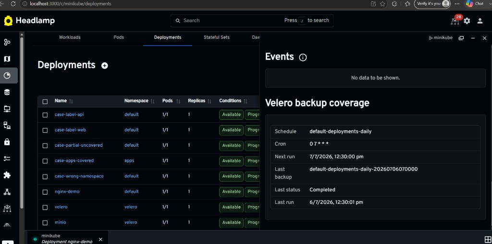
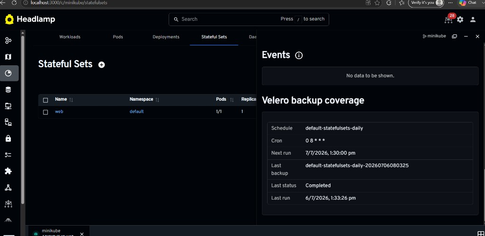
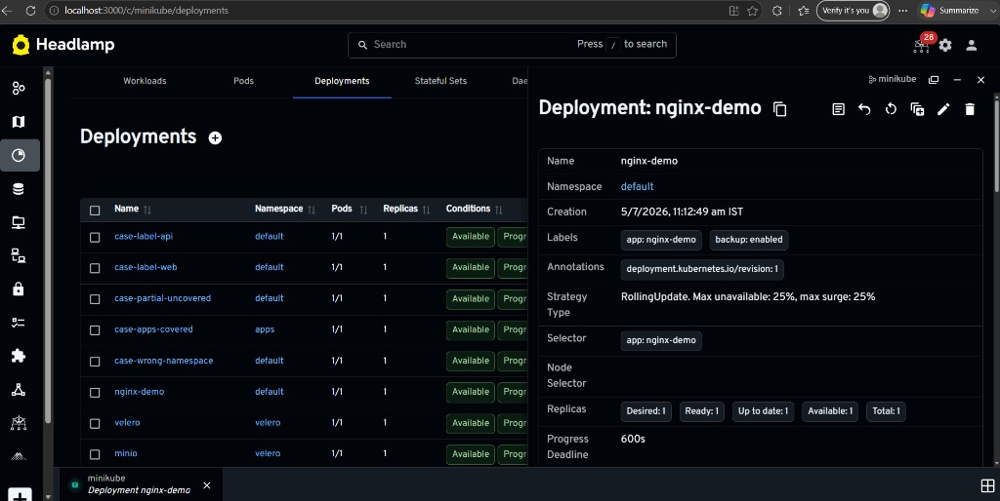

# Velero plugin for Headlamp

Contextual Velero backup coverage panels for Headlamp ([Phase 1](https://github.com/kubernetes-sigs/headlamp/issues/5198)).

## What it does

Shows whether a workload or namespace is covered by a Velero backup schedule — directly on the resource detail page in Headlamp.

- **Deployment, StatefulSet, PVC** detail views — matching schedules, cron, next run, last backup status
- **Namespace** detail view — schedules with any coverage in that namespace
- **Read-only** — no backup or restore actions
- **Velero not installed** — clear empty state

## Plugin settings

**Settings → Plugins → Velero**

| Setting          | Default  | Purpose                                                 |
| ---------------- | -------- | ------------------------------------------------------- |
| Velero namespace | `velero` | Namespace where Velero `Schedule` and `Backup` CRs live |

## RBAC

The Headlamp service account (or user token) needs read access to Velero CRDs:

```yaml
rules:
  - apiGroups: ['velero.io']
    resources: ['backups', 'schedules', 'restores', 'backupstoragelocations']
    verbs: ['get', 'list', 'watch']
```

## Development

```bash
cd plugins/velero
npm install
npm start
```

Copy the built plugin into Headlamp, or load from this folder per the [plugin development docs](https://headlamp.dev/docs/latest/tutorials/plugin-development/).

## Manual testing

Apply the fixtures under `test-files/` to a cluster with Velero installed, then open the listed resources in Headlamp.

## Screenshots

Deployment covered by a Velero schedule (`nginx-demo`):



StatefulSet covered by a namespace schedule (`web`):



Deployment detail view with matching test fixtures in the cluster:



## Tests

```bash
npm test
# or, if the wrapper fails on paths with spaces:
npx vitest run -c node_modules/@kinvolk/headlamp-plugin/config/vite.config.mjs
```
