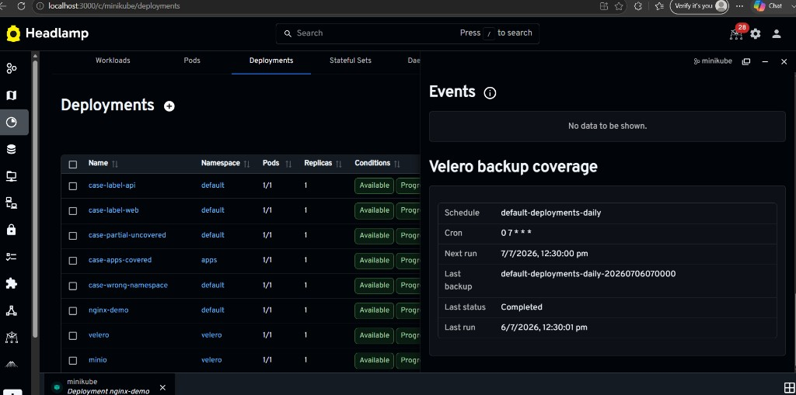
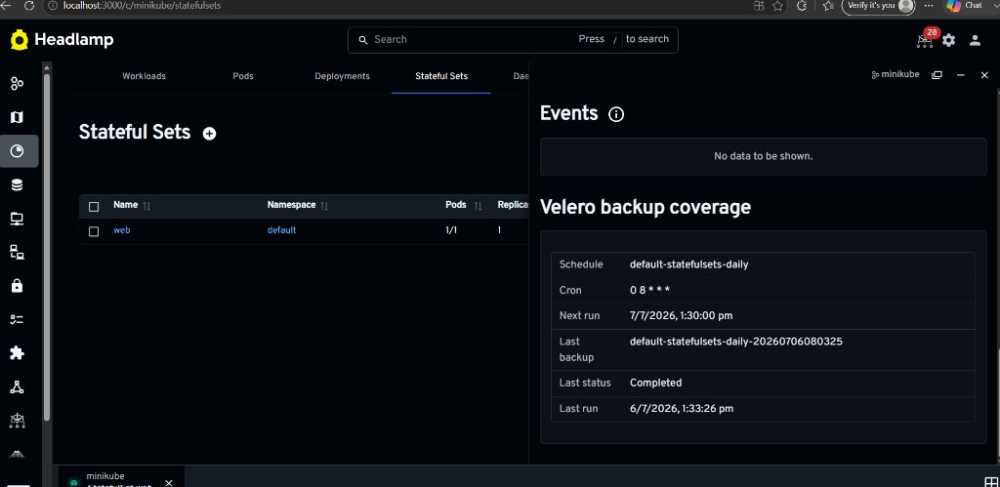
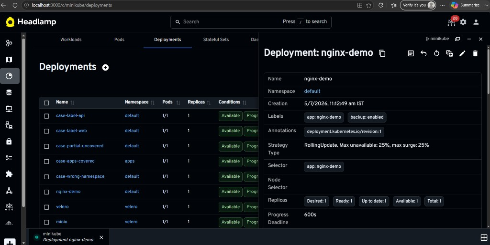

# Velero plugin for Headlamp

Contextual Velero backup coverage for Headlamp ([issue #5198](https://github.com/kubernetes-sigs/headlamp/issues/5198)).

## What it does

### Phase 1 — Detail coverage panels

Shows whether a workload or namespace is covered by a Velero backup schedule — directly on the resource detail page in Headlamp.

- **Deployment, StatefulSet, PVC** detail views — matching schedules, cron, next run, last backup status
- **Namespace** detail view — schedules with any coverage in that namespace
- Coverage matching uses Schedule template include/exclude filters and label selectors (`matchLabels`, `matchExpressions`, `orLabelSelectors`). Unknown selector operators fail closed (not reported as covered).
- **Read-only** — no backup or restore actions
- **Velero not installed** — clear empty state

### Phase 2 — Cluster-wide Velero views

Sidebar entry **Velero** with:

- **Schedules** — cron, status, next run, last backup
- **Backups** — phase, triggered by schedule or manual, namespace scope
- **Restores** — backup source, phase, errors/warnings, progress (list/detail inspired by [reasonerjt prototype](https://github.com/reasonerjt/velero-headlamp-plugin))

Coverage panels and schedule views load schedule-owned Backups via a `velero.io/schedule-name` label selector, then keep the latest Backup per schedule client-side (long TTLs can still return large histories). The Backups sidebar list still shows the full Backup table. Create actions are deferred to a later phase.

## Plugin settings

**Settings → Plugins → Velero**

| Setting          | Default  | Purpose                                                     |
| ---------------- | -------- | ----------------------------------------------------------- |
| Velero namespace | `velero` | Namespace where Velero Schedule / Backup / Restore CRs live |

## RBAC

The Headlamp service account (or user token) needs read access to Velero CRDs:

```yaml
rules:
  - apiGroups: ['velero.io']
    resources: ['backups', 'schedules', 'restores', 'backupstoragelocations']
    verbs: ['get', 'list', 'watch']
```

## Development

```bash
cd plugins/velero
npm install
npm start
```

Copy the built plugin into Headlamp, or load from this folder per the [plugin development docs](https://headlamp.dev/docs/latest/tutorials/plugin-development/).

## Manual testing

Apply the fixtures under `test-files/` to a cluster with Velero installed, then:

1. Open a Deployment / StatefulSet / Namespace detail page for Phase 1 panels
2. Open sidebar **Velero → Schedules / Backups / Restores** for Phase 2

## Screenshots

Deployment covered by a Velero schedule (`nginx-demo`):



StatefulSet covered by a namespace schedule (`web`):



Deployment detail view with matching test fixtures in the cluster:



## Tests

```bash
npm test
# or, if the wrapper fails on paths with spaces:
npx vitest run -c node_modules/@kinvolk/headlamp-plugin/config/vite.config.mjs
```
